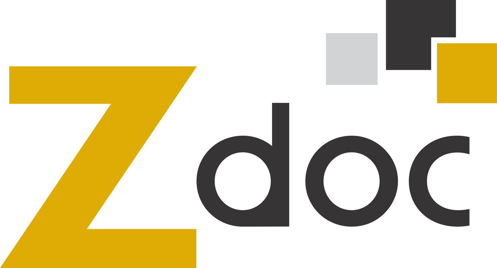

  

<h1 align="center">Zdoc Tecnologia - Escritório</h1>

  Projetos desenvolvidos pela equipe de desenvolvimento do Escritório da Zdoc.

## 👨‍💻 Nossa Equipe

Equipe dedicada ao desenvolvimento de sistemas e ferramentas que impulsionam os processos do Escritório Zdoc e das secretarias às quais prestamos serviços.
Buscamos sempre qualidade, colaboração e inovação em cada projeto.

## 📂 Principais Projetos

- **[Attendance](#)** – Sistema de atendimento .
- **[Métiz](#)** – Sistema de gestão documental utilizado por diversas secretarias do estado.
- **[RH](#)** – Sistema interno para gestão de funcionários.
- **[SCC](#)** – Sistema de controle de cargos da Secretaria de Estado da Casa Civil

## 🛠️ Tecnologias que utilizamos

## 🤝 Como contribuir

_apenas colaboradores da equipe zdoc podem visualizar e contribuir para os projetos_

1. Abra uma _issue_ descrevendo sua ideia ou problema.
2. Crie uma branch a partir da `main`.
3. Abra um _pull request_ e aguarde a revisão.

## 📫 Contato

[LinkedIn](https://www.linkedin.com/company/zdoc-gti/?originalSubdomain=br)

diegotrindade@zdoc.com.br |
lucas@zdoc.com.br |
matheusfelipe@zdoc.com.br |
linda@zdoc.com.br
